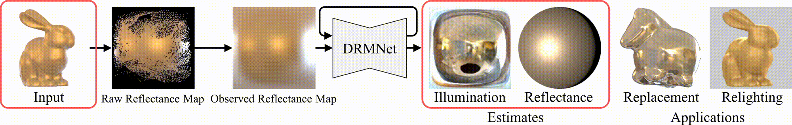

# Diffusion Reflectance Map: Single-Image Stochastic Inverse Rendering of Illumination and Reflectance
[arXiv](https://arxiv.org/abs/2312.04529)

This repository provides an implementation of our paper [Diffusion Reflectance Map: Single-Image Stochastic Inverse Rendering of Illumination and Reflectance](https://arxiv.org/abs/2312.04529).
This implementation is based on [Latent Diffusion Modle](https://github.com/CompVis/latent-diffusion/).

Please note that this is a research software and may contain bugs or other issues – please use it at your own risk. If you experience major problems with it, you may contact us, but please note that we do not have the resources to deal with all issues.

Please cite the following paper, if you use any part of our code and data.
```
@InProceedings{Yenyo_2022_CVPR,
    author    = {Enyo, Yuto and Nishino, Ko},
    title     = {Diffusion Reflectance Map: Single-Image Stochastic Inverse Rendering of Illumination and Reflectance},
    booktitle = {Proceedings of the IEEE/CVF Conference on Computer Vision and Pattern Recognition (CVPR)},
    month     = {June},
    year      = {2024},
}
```



## Requirements

We tested our code with Python 3.8 on Ubuntu 20.04 LTS using the following packages.

- numpy==1.23.5
- pytorch==1.12.1
- torchvision==0.13.1
- mitsuba==3.2.0
- pytorch-lightning==1.9.0
- opencv-python==4.9.0.80
- omegaconf
- einops
- and packages for [Latent Diffusion Modles](https://github.com/CompVis/latent-diffusion?tab=readme-ov-file#requirements) (some are imported to avoid errors but not actually used)

Please refer to [environment/pip_freeze.txt](environment/pip_freeze.txt) for the specific versions we used.

You can also use `singularity` to replicate our environment:
```bash
singularity build environment/drmnet.sif environment/drmnet_release.def
singularity run --nv environment/drmnet.sif
```

## Usage

### Demo

You can download the pretrained models (`drmnet.ckpt` and `obsnet.ckpt`) from [here](https://drive.google.com/drive/folders/1zWkmzOIIwueeUL0ryzK6FU8TtW6g4T6W). Download them and save the files in `./checkpoints`.
You can apply the model on the sample data in the `data` directory by running the script below.

```bash
python scripts/estimate.py --input_img ./data/sample/image.exr --input_normal ./data/sample/normal.npy --input_mask ./data/sample/mask.png
```

You can view the outputs in `outputs`.

### Training

#### Data

The reflectance maps for training are rendered with random sampling during training.

You can download the cached training data from [here](https://drive.google.com/drive/folders/1zWkmzOIIwueeUL0ryzK6FU8TtW6g4T6W).
To use it, you need to use same pytorch version.
Please unzip the cached data to `data/cache/` by running:
```bash
unzip <PATH_TO_refmap_cache.zip> -d ./data/cache/refmap
unzip <PATH_TO_objimg_cache.zip> -d ./data/cache/objimg
```

After unzipping caches, `data/cache` will look like below:
```
data/cache
├── /refmap/<BRDF_PARAM_NAMES>/<RESOLUTION_SPP_DENOISER>
│   ├── <ENVMAP_NAME>/
│   │   ├── b<BRDF_PARAM>v<VIEW_FROM>.pt
│   │    ...
│    ...
├── /objimg/<BRDF_PARAM_NAMES>/
│   ├── <RESOLUTION_SPP>
│   │   ├── <ENVMAP_NAME>/
│   │   │   ├── <OBJECT_NAME>/
│   │   │   │   ├── b<BRDF_PARAM>v<VIEW_FROM>.pt
│   │   │   │    ...
│   │   │    ...
│   │    ...
│   ├── <RESOLUTION_SPP>_rawrefmap
│   │   ├── <ENVMAP_NAME>/
│   │   │   ├── <OBJECT_NAME>/
│   │   │   │   ├── b<BRDF_PARAM>v<VIEW_FROM>.pt
│   │   │   │    ...
│   │   │    ...
│   │    ...
```

Also, you need to download masks for reflectance maps to train ObsNet from [here](https://drive.google.com/drive/folders/1zWkmzOIIwueeUL0ryzK6FU8TtW6g4T6W) and unzip the cached data to `data/nLMVS-Synth_refmap_masks/` by running:
```bash
unzip <PATH_TO_nLMVS-Synth_refmap_masks.zip> -d ./data/nLMVS-Synth_refmap_masks
```


The training data is made using the following data:
- HDR Environment maps from [Laval Indoor HDR Dataset](http://vision.gel.ulaval.ca/~jflalonde/publications/projects/deepIndoorLight/index.html) and [Poly Haven](https://polyhaven.com/)
- 3D mesh models of [Xu et al.](https://cseweb.ucsd.edu/~viscomp/projects/SIG18Relighting/)
- Normal maps from nLMVS-Synth from [nLMVS-Net](https://github.com/kyotovision-public/nLMVS-Net) 

If you want to train without the above cache, please download HDR Environment maps from the above sites, save them to `./data/LavalIndoor+PolyHaven_2k` in OpenEXR format (`.exr`) with a resolution of 2000x1000. You can use `scripts/preprocess_envmap.py` for this.

Also, please download object shapes from [Xu et al.](https://cseweb.ucsd.edu/~viscomp/projects/SIG18Relighting/) and preprocess them by running:
```bash
python scripts/preprocess_shape.py <PATH_TO_Shapes_Multi_5000>
```


#### DRMNet

You can train DRMNet by running
```bash
python main.py --base ./configs/drmnet/train_drmnet.yaml -t --device 0
```
The logs and checkpoints are saved to `logs/<START_DATE_AND_TIME>_train_drmnet`.

#### ObsNet

You can train ObsNet by running
```bash
python main.py --base ./configs/obsnet/train_obsnet.yaml -t --device 0
```
The logs and checkpoints are saved to `./logs/<START_DATE_AND_TIME>_train_obsnet`.

In order to finetune the ObsNet model, you need to modify the configuration file located at `./configs/inpainting/finetune_obsnet.yaml`.
The default value for `model: params: ckpt_path` is set to `./logs/xxxx-xx-xxTxx-xx-xx_train_obsnet/checkpoints/last.ckpt`.
To finetune the network using raw reflectance maps from random object images, update this path with the above directory and run:
```bash
python main.py --base ./configs/obsnet/finetune_obsnet.yaml -t --device 0
```
.
The logs and checkpoints are saved to `./logs/<START_DATE_AND_TIME>_finetune_obsnet`.
